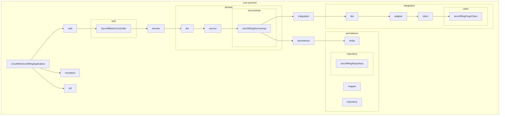
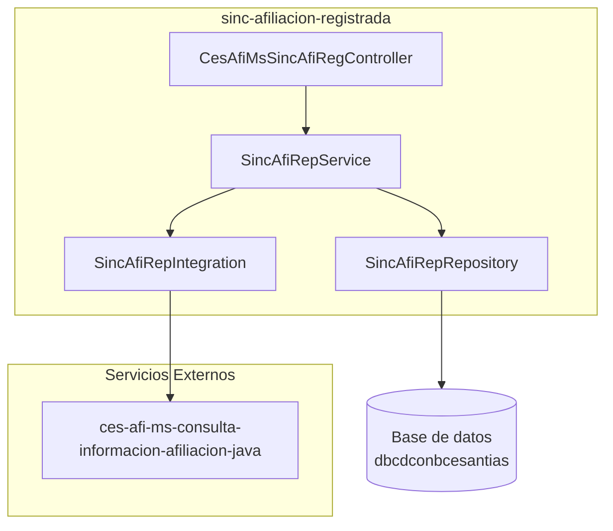
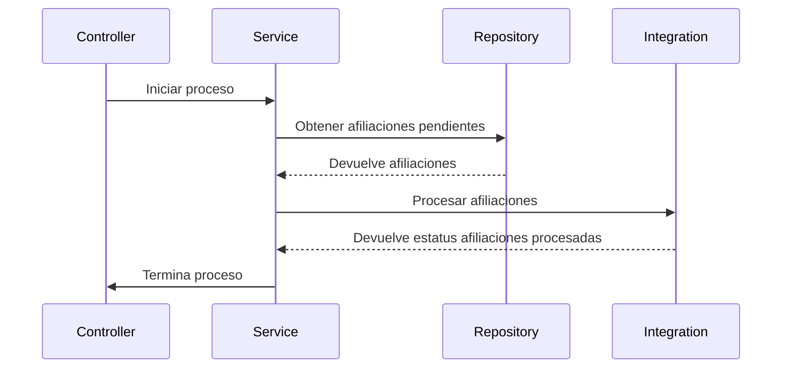
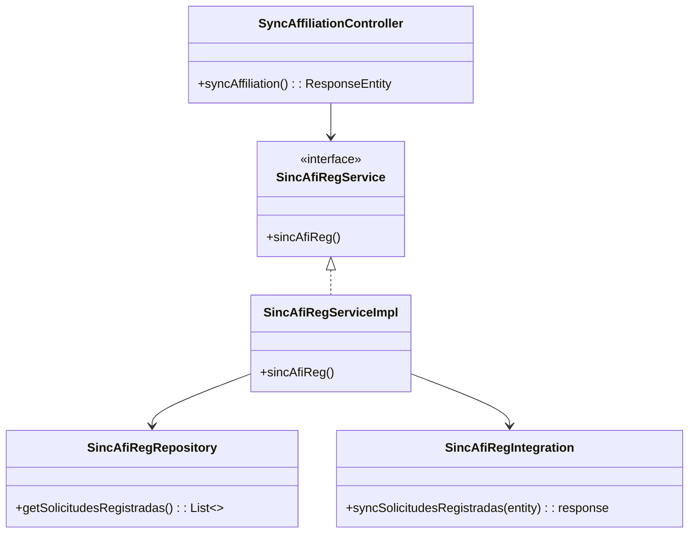
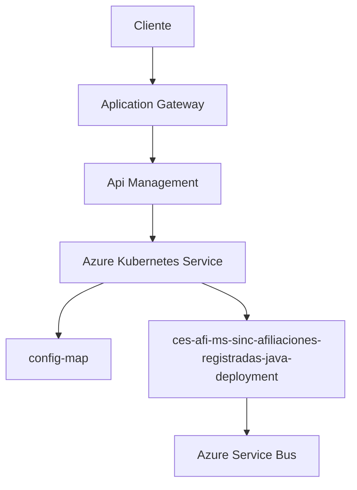

# ces-afi-ms-sinc-afiliaciones-registradas-java

**Autor:** [por14572](https://github.com/POR14572_porvenir)

[](https://opensource.org/licenses/Apache-2.0)
[](https://www.oracle.com/java/technologies/javase/jdk11-archive-downloads.html)
[](https://spring.io/projects/spring-boot)
[](https://azure.microsoft.com/en-us/services/service-bus/)
[](https://maven.apache.org/download.cgi)

## **Introducción**

### **Objetivo**

El presente proyecto de SpringBoot tiene como finalidad generar los reportes de Extracto de Plan Empresarial de Porvenir
en formato PDF.

### **Información del Servicio**

- Nombre del Servicio:  **extracto-cuenta** **(Pendiente)**

#### **Descripción**

- **Funcionalidad Principal:** El o los microservicios a partir de los parámetros de la petición responderán generando
  un reporte de Extracto de Plan Empresarial. Este archivo será accedido por medio de la URL generada en Azure Blob
  Storage.

- **Namespace:** ns-cesantias-afiliaciones

- **Conexiones Base de datos:**
  Base de datos: dbptcdconbcesantias, dbqacdconbcesantias, dbcdconbcesantias
  Esquema: dbo
  Tablas accedidas directamente: ces_afl_solicitud
  Tablas accedidas a través de servicios:  N/A

### **Especificaciones Técnicas**

#### **Tecnología a utilizar**

- Lenguaje de Programación: Java 21
- Framework: Spring Boot 3.4.5
- Gestor de dependencias: Maven 4.0.0
- Logs: Lombok 1.18.38

- Contenedores: Docker

- Orquestador de Contenedores PT: AKS AZ-EU-PV-PT-CE-PVYC-AKS-01
- Orquestador de Contenedores QA: AKS AZ-EU-PV-QA-CE-PVYC-AKS-01
- Orquestador de Contenedores PROD: AKS AZ-EU-PV-PRD-CE-PVYC-AKS-01

### **Descripción Funcionalidad del Servicio**

- **Consulta de :** El servicio cuenta con un parámetro de entrada en la petición que corresponde al número del
  contrato.

| **Dato**   | **Tipo de dato** | **Descripción**         | **Longitud**  | **Obligatorio** | **Ejemplo** |
|------------|------------------|-------------------------|---------------|-----------------|-------------|
| idContrato | numérico         | ID o Número de Contrato | 30 caracteres | SI              | 412513      |

- **Endpoints Expuestos:**

    - **/extractoEmpresarial**: Ruta general que contiene el o los microservicios asociados a la generación de Extracto
      Plan Empresarial.
    - **/generarReporte**: Ruta específica que genera el reporte en formato PDF y realiza el cargue en Microsoft Azure
      Blog Storage como almacenamiento.

# Estructura de Paquetes del Proyecto

Este proyecto está pensado para que funcione con una arquitectura hexagonal, por lo que se dividen responsabilidades y
funcionalidades por cada paquete.

com.porvenir.extracto_empresarial

- **ExtractoEmpresarialApplication.java**: Como punto de entrada de la aplicación
- **adapters**: Su funcionalidad principal es adaptar las entradas y salidas que requiera el proyecto. En esta
  paquetería también se incluyen adaptadores de librerías implicadas en la parte de infraestructura de la aplicación (
  JasperReports o JacksonCore).
- **application**: Responsable de utilizar los casos de uso según las petición de entrada. Obtener información externa (
  microservicios de Porvenir) y construir los elementos necesarios.
- **domain** : Responsable de definir los modelos u objetos que son invariantes a la parte técnica.

## **Diagrama del Servicio**

## Características

- **Interfaz RESTful**: Exposición de servicios a través de una API RESTful, facilitando la integración con otras
  aplicaciones y sistemas.

- **Validación de Datos**: Implementa validaciones de entrada robustas para asegurar la integridad y exactitud de los
  datos ingresados.

- **Manejo de Errores**: Sistema de manejo de errores centralizado que proporciona respuestas claras y útiles en caso de
  fallos o problemas en el procesamiento de los reportes de Extracto de Plan Empresarial.

- **Documentación Automática de la API**: Integración con herramientas como Swagger para generar documentación
  interactiva de la API, facilitando la comprensión y el uso de los servicios.

- **Pruebas Automatizadas**: Incluye pruebas unitarias y de integración para asegurar la calidad y estabilidad del
  código.

- **Despliegue en la Nube**: Preparado para ser desplegado en plataformas en la nube, con soporte para configuraciones
  específicas de despliegue en servicios como Azure.

- **Alta Disponibilidad y Escalabilidad**: Diseñado para manejar grandes volúmenes de datos y tráfico, con capacidades
  para escalar según las necesidades.

### **Arquitectura de la aplicación**

### Diagrama de paquetes

A continuación se muestra un diagrama de paquetes que representa la estructura general del proyecto
`ces-afi-ms-sinc-afiliaciones-registradas-java`:



#### Descripción de los paquetes

- **web**: Contiene las clases controladoras que manejan las solicitudes HTTP y definen los puntos de entrada de la API.
- **dto**: Contiene las clases de transferencia de datos (DTO) que se utilizan para transportar información entre las
  capas de la aplicación.
- **mapper**: Contiene las clases encargadas de mapear los objetos de dominio a DTO y viceversa.
- **model**: Contiene las clases que representan los objetos de dominio de la aplicación.
- **repository**: Contiene las interfaces y clases de repositorio que se utilizan para acceder a la capa de persistencia
  de datos.
- **service**: Contiene las clases de servicio que implementan la lógica de negocio de la aplicación.
- **CesAfiMsSincronizaAfiliacionApplication**: Clase principal que inicia la aplicación Spring Boot.

Este esquema de paquetes proporciona una estructura organizada y modular para el proyecto, facilitando el desarrollo y
mantenimiento del código. Cada paquete tiene una responsabilidad específica y contribuye a la arquitectura general de la
aplicación.

### Diagrama de componentes

El siguiente diagrama de componentes muestra la interacción entre los componentes principales de la aplicación
`ces-afi-ms-sinc-afiliaciones-registradas-java`:



### Diagrama de secuencia

El siguiente diagrama de secuencia ilustra el flujo de interacción entre los componentes de la aplicación
`ces-afi-ms-sinc-afiliaciones-registradas-java` al procesar una afiliación :



### Diagrama de clases

El siguiente diagrama de clases muestra las clases y sus relaciones en la aplicación
`ces-afi-ms-sinc-afiliaciones-registradas-java`:



### Diagrama de despliegue

El siguiente diagrama de despliegue muestra la arquitectura de despliegue de la aplicación
`ces-afi-ms-sinc-afiliaciones-registradas-java` en un entorno de producción:



En este diagrama, el cliente interactúa con la aplicación a través de un Application Gateway y un API Management. La
aplicación se despliega en un Azure Kubernetes Service (AKS) y se conecta a servicios externos como Azure Service Bus y
Azure SQL Database. Además, la aplicación utiliza Azure Key Vault para almacenar secretos y configuraciones sensibles, y
Kibana para monitorear y analizar los registros de la aplicación.

### Diagrama de Datos

N/A

## Descripcion de Servicios

El proyecto `ces-afi-ms-sinc-afiliaciones-registradas-java` no contiene un endpoint ya que se trata de una tarea
programada

### Request Parameters

| **Dato**    | **Tipo de dato** | **Descripción**     | **Longitud**  | **Obligatorio** | **Ejemplo** |
|-------------|------------------|---------------------|---------------|-----------------|-------------|
| idSolicitud | numérico         | ID de la afiliación | 30 caracteres | SI              | 21132       |

### Request

```http
GET /service/cesantias/afiliaciones/registradas/afiliacion HTTP/1.1
Host: securepvycqa2.afpporvenir.com
Content-Type: application/json
Authorization: Bearer token...
{
  "idSolicitud": "21132"
}
```

### Responses

#### 202 Accepted:

```json
{
  "status": {
    "statusCode": "202",
    "statusDescription": "Petición procesada correctamente"
  },
  "dataUrl": ""
}
```

#### 235 Custom

```json
{
  "status": {
    "statusCode": "235",
    "statusDescription": "Solicitud enviada correctamente"
  },
  "dataUrl": ""
}
```

#### 236 Custom

```json
{
  "status": {
    "statusCode": "235",
    "statusDescription": "Solicitud enviada correctamente"
  },
  "dataUrl": ""
}
```

#### 237 Custom

```json
{
  "status": {
    "statusCode": "237",
    "statusDescription": "Se ha generado la notificación de..."
  },
  "dataUrl": ""
}
```

#### 238 Custom

```json
{
  "status": {
    "statusCode": "238",
    "statusDescription": "La ejecución de generación de pdf ..."
  },
  "dataUrl": ""
}

```

#### 400 Bad Request - REQUEST_WITHOUT_HEADERS:

```json
{
  "status": {
    "statusCode": "400",
    "statusDescription": "Error - Datos de entrada requeridos ..."
  }
}
```

#### 500 Internal Server Error:

```json
{
  "status": {
    "statusCode": "500",
    "statusDescription": "Error interno de servidor. Por favor ..."
  },
  "dataUrl": ""
}
```

## Getting Started

Para iniciar el proyecto `extracto_cuenta` se recomienda tener instalado Java 21 (en su versión de Oracle o sus
diferentes versiones libres - OpenJDK).
Igualmente es recomendable tener instalado Maven (versión especificada anteriormente).

### Prerequisites

- Java 21
- Maven (4.0.0)

### Installation

Follow these steps to set up the development environment:

1. **Clone el repositorio:**

   ```
   git clone (por definir)
   ```

2. **Navigate to the project directory**:

   ```
   cd extracto_cuenta
   ```

3. **Run Maven Wrapper to compile the project**:
   ```
   ./mvnw clean install
   ```

4. **Run the Spring Boot Application**
    ```
   ./mvnw spring-boot:run
   ```